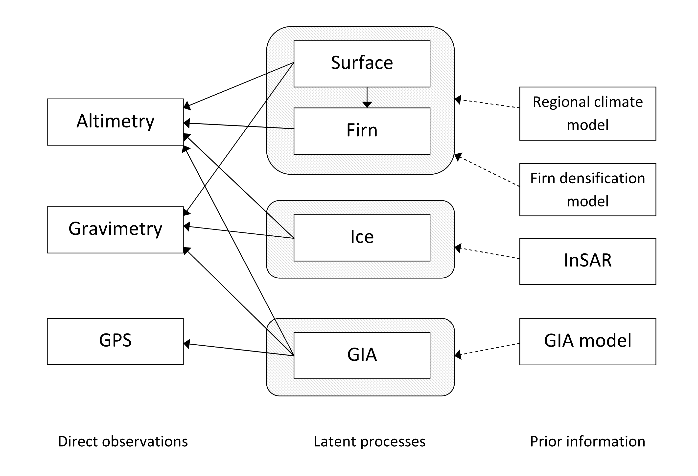

## Introduction

 
   

> Environmental systems are characterised by phenomena which evolve
both in space and in time (cloud modelling, weather and climate,
glacial ow, spread of invasive species etc.).

 

> The aim of spatio-temporal modelling is to
  1. **Assimilate** all knowledge (observables etc.) pertaining to the process/es of interest in an objective way (although some of the beliefs we incorporate might be subjective).
  2. **Infer** parameters governing the spatio-temporal process in order to
    -  Further our understanding of the process and 
    -  Predict in both space and time.

---

## Introduction

    

---

## Introduction

    

---

## Bayesian Hierarchical Modelling

$  
   \def\bold#1{\mathbf #1}
   \def\yvec{\bold{y}}
   \def\svec{\bold{s}}
   \def\vvec{\bold{v}}
   \def\wvec{\bold{w}}
   \def\gammab{\bold{\gamma}}
   \def\thetab{\bold{\theta}}
$

Divide an conquer approach to a complext problem.
- $\yvec_t$: observables
- $X_t(\svec)$: spatio-temporal process
- $\vvec_t$: observation error
- $\wvec_t$: random forcing
- $\thetab_i$: process/observation parameters
- $\gammab_i$: hyper-parameters

- L1: Observation model: $\yvec_t = g(X_t(\svec), \vvec_t; \thetab_h)$
- L2: Process model:    $X_t(\svec) = f(\svec,t,\wvec_t(\svec); \thetab_m)$
- L3: Parameter model: $p(\thetab_m ; \gammab_m), p(\thetab_h; \gammab_h), p(\thetab_v ; \gammab_v), p(\thetab_w; \gammab_w)$

---

## What for $X_t(\svec)$?

Two approaches:

Geo-statistical models: 

$$X_t(\svec) \sim GP(\mu_t(\svec),K(t,t',\svec,\svec'))$$

This can be seen as a general-purpose model when the dynamic structure is largely unknown.

2. Dynamic (mechanistically-motivated) models
$X_t(\svec) = f(X_{t-1}(\svec), X_{t-2}(\svec), \dots, \wvec_t(\svec); \thetab_m)$

Examples:
  - STAR models
  - Integro-difference equation models
  - PDE models
 - CMLs

